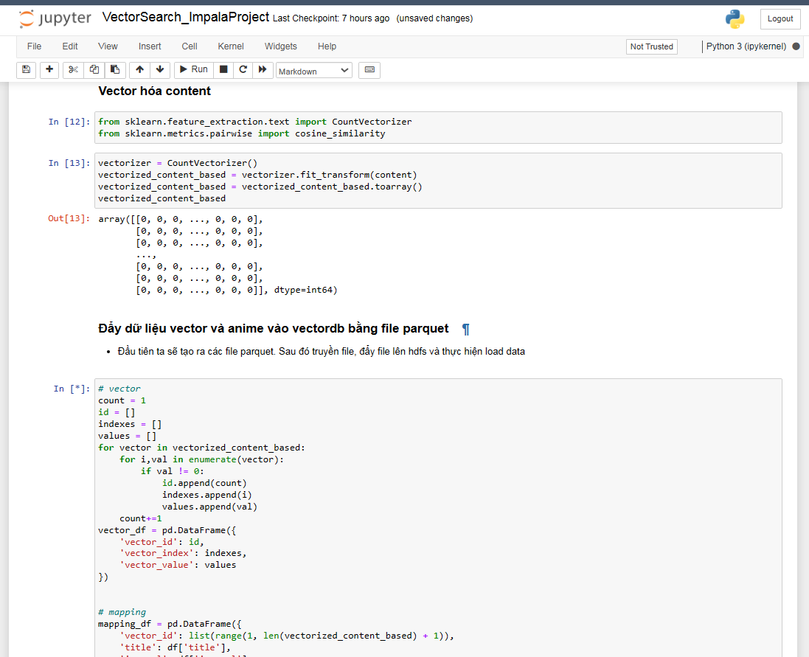

# Impala Project - Vector-Search

## 1. Giới thiệu
- Impala là một **query engine** có rất nhiều các ưu điểm như: hiệu suất cao, xử lý song song khối lượng lớn, là công cụ SQL có hiệu suất cao (mang lại trải nghiệm giống RDBMS), cung cấp cách nhanh nhất để truy cập dữ liệu được lưu trữ trong hệ thống tệp phân tán Hadoop, ... 
- Lợi dụng những ưu điểm đó Project này sẽ sử dụng Impala để làm Query engine để mô phỏng Vector Search cho một hệ thống gợi ý anime cho user 
- Các thao tác trong Project này bao gồm các bước sau: 
> - Kết nối với Impala bằng gói thư viện Impyla 
> - Vector hóa dữ liệu, chuyển thành file parquet và đẩy vào database 
> - Xây dựng hệ thống truy vấn so sánh vector - Vector Search 

- Những tài nguyên cần thiết cho Project: 
> - Một máy ảo **Cloudera QuickStartVM** 
> - **Jupyter notebook (Python)** 
> - Một số thư viện python cần thiết khác 

## 2. Triển khai Project
- Ta cần khởi động máy ảo **Cloudera QuickStartVM** cùng các service và lấy địa chỉ IP của máy ảo 

- Mở **Jupyter Notebook (Python)** và chạy các dòng lệnh để thực hiện:
> - Kết nối với Impala bằng gói thư viện Impyla 
> - Vector hóa dữ liệu, chuyển thành file parquet và đẩy vào database 
> - Xây dựng hệ thống truy vấn so sánh vector - Vector Search 

- Mở **demoApp.py** bằng **streamlit run** để xem demo App

- Cách thức hoạt động của **Vector Search Program**

## 3. Kết luận
- **Về Tốc Độ:** 
> - Tốc độ truy vấn của Impala đã được chứng minh là rất nhanh trong Demo Project này. Với điều kiện vật chất tốt hơn và việc phát triển thêm về cách lưu trữ, như phân vùng và giải thuật index tối ưu hơn, Impala có tiềm năng để cải thiện thời gian truy vấn hơn nữa. 

- **Về Hiệu Suất:**
> - Trong quá trình thử nghiệm, Impala đã thể hiện khả năng xử lý dữ liệu với tốc độ ấn tượng. Điều này chứng tỏ tiềm năng lớn của Impala khi triển khai trong môi trường sản xuất. Số lượng lớn thông tin anime và dòng thông tin vector phim không làm ảnh hưởng đến khả năng xử lý của Impala, điều này là một ưu điểm lớn so với các query engine thông thường. 

- **Về Khả Năng Mở Rộng:** 
> - Impala đã chứng minh sự linh hoạt trong việc mở rộng và điều chỉnh để phù hợp với nhu cầu và quy mô dữ liệu của dự án. Tối ưu hóa cách lưu trữ, bao gồm phân vùng và sử dụng các giải thuật index hiệu quả, có thể giúp tăng cường hiệu suất của Impala trong tương lai. 

- **Kế Hoạch Phát Triển Dự Án:** 
> - Tiếp tục nghiên cứu và thử nghiệm các phương pháp tối ưu hóa khác nhau để tăng cường hiệu suất và khả năng mở rộng của Impala. 
> - Xem xét việc triển khai các cải tiến về cách lưu trữ và quản lý dữ liệu để tối ưu hóa việc sử dụng Impala trong môi trường sản xuất. 

